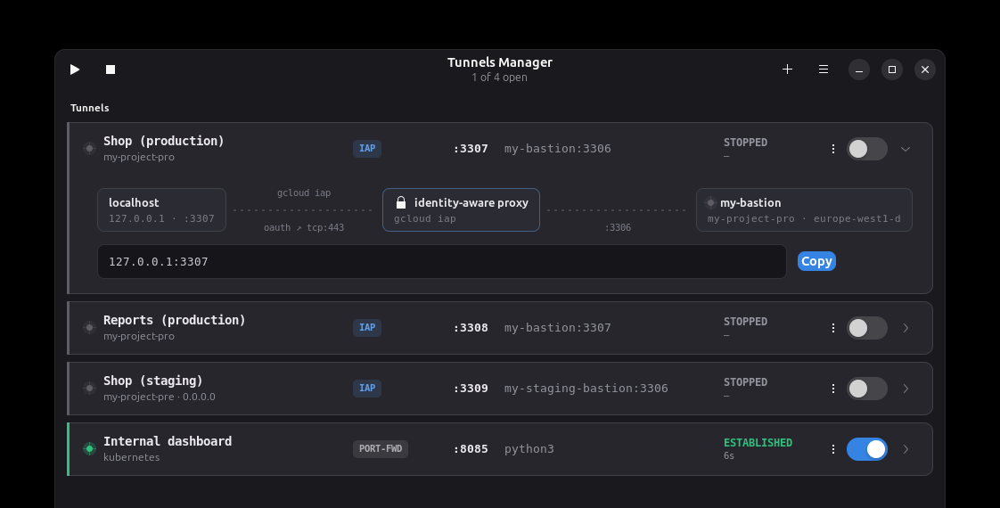

<div align="center">

# Tunnels Manager

**One switch per tunnel, and the path it takes when you open it.**

A small GTK4 app for the tunnels you live on: Google Cloud IAP tunnels,
`kubectl port-forward`, `ssh -L`. One window, one row each, and a click on a row draws
what is between you and the far end.

[](LICENSE)




</div>

## Why

Opening a tunnel is one command. Remembering which of your fifteen local ports belongs to
which database, noticing that one of them silently died, and not leaving orphan `gcloud`
processes behind is the actual work. Tunnels Manager does that part:

- **One switch per tunnel**, with its state right next to it, in a table whose columns are
  fixed: nothing on the row moves as it connects.
- **Open a row and you see the path** -- this machine, the identity-aware proxy, the far end
  -- with the hop that is being negotiated lit up, and the one that broke marked in red.
- **The port is a button.** Click it and it is on your clipboard.
- **A round trip you can trust.** While a tunnel is up the app times how long the far end
  takes to answer *through the tunnel*, and says so under a small graph. There is nothing
  invented on screen: no answer means a dash, not a number.
- **It tells you when something breaks.** A tunnel that dies goes red with the reason, and
  the row explains it instead of quietly keeping a dead port.
- **No orphan processes.** Closing a tunnel kills its whole process group; closing the
  window closes every tunnel.
- **Local ports stay unique**, and when one is taken the app offers to free it.

## Install

Requirements: Linux with GTK 4.12+, Python 3.11+, and `gcloud` if you use IAP tunnels.

```bash
git clone https://github.com/lucianobosco/tunnels-manager.git
cd tunnels-manager
./install.sh
```

`install.sh` checks its dependencies first and prints the exact command if something is
missing. **On a GNOME desktop there is usually nothing to install**: GTK 4 and libadwaita
are already there because the desktop itself uses them, and so are the Python bindings.
If the check does complain, on Debian or Ubuntu it is:

```bash
sudo apt install python3-gi gir1.2-gtk-4.0 gir1.2-adw-1 python3-yaml
```

Those packages are the *bindings and typelibs* that let Python talk to the GTK libraries
already on your system — not GTK itself. They cannot come from `pip`: PyGObject publishes
no binary wheels, and even compiled it would still need the native libraries.

No sudo, and nothing outside your `$HOME`: a launcher in `~/.local/bin`, a desktop entry
and an icon in `~/.local/share`, and your configuration in
`~/.config/tunnels-manager/tunnels.yaml`. To uninstall, delete those four things.

The desktop entry and the icon are named after the application id, which the desktop needs
to be globally unique — it is what keeps a single instance alive and matches the window to
its launcher. If you fork this, install under your own id without editing any source file:

```bash
APP_ID=com.example.MyTunnels ./install.sh
```

Then search for **Tunnels Manager** in your launcher, or run `tunnels-manager`.

On first run the configuration is created from [`tunnels.dist.yaml`](tunnels.dist.yaml),
which is an example with made-up names. Replace those tunnels with yours.

## Use it

```
Databases
  ● Shop (production)     IAP        :3307   my-bastion:3306    ESTABLISHED  ⋮ ▉▁ ▸
    my-project-pro                                             12m
  ● Reports (production)  IAP        :3308   my-bastion:3307    FAILED       ⋮ ▁▉ ▸
    my-project-pro                                             port in use
Services
  ● Internal dashboard    PORT-FWD   :8080   svc/dashboard:80   ESTABLISHED  ⋮ ▉▁ ▾
    kubernetes                                                 1m
    ┌ localhost ────┐ gcloud iap ···· ┌ 🔒 proxy ─┐ ···· ┌ my-bastion ─────┐
    │ 127.0.0.1 :8080│               │ 41 ms     │      │ project · zone  │
    └───────────────┘                └──────────┘       └─────────────────┘
    127.0.0.1:8080                                    [ Copy ]   ╱╲╱ rtt 41 ms
```

| Action | How |
| --- | --- |
| Open or close a tunnel | The switch on its row |
| See the path, and the string to paste | Click the row; click again to close it |
| Copy the local port | Click the port number |
| Open every tunnel / close every tunnel | ▶ and ■ in the header |
| Per-tunnel actions | The ⋮ menu: view log, restart, free the port, copy, edit, delete |
| Shortcuts, new tunnel, reload | The ☰ menu |

Keyboard: `Ctrl+N` new tunnel · `Ctrl+R` reload the configuration · `Ctrl+Q` quit.

### What a row tells you

| Element | Meaning |
| --- | --- |
| The stripe and the dot | The state, in colour, down the left edge of the card |
| `IAP` / `PORT-FWD` | How the tunnel is opened. Hover it for the whole route |
| `0.0.0.0` in the subtitle | It listens on every interface: anyone on your network can use it |
| `STOPPED` | No process |
| `CONNECTING` | The command started; the local port is not open yet |
| `ESTABLISHED` + `12m` | Open, and for how long |
| `FAILED` + a reason | It failed or died; the full text is in the tooltip and in the log |

The second line under the state always exists — an em dash when there is nothing to say —
so the state never jumps as a tunnel connects. Every column is fixed for the same reason.

### What an open row tells you

The three boxes are this machine, the identity-aware proxy, and the far end. A pulse of
light walks the path while a hop is being negotiated, the box at the far end takes the
colour of the state, and the hop that broke goes red.

Under them, the address to paste with a **Copy** button, and on the right the round trip
measured *through the tunnel*: the app opens a connection and times the first byte the far
end sends back, every 15 seconds while the tunnel is up. A server that greets nobody gets
a dash rather than an invented number. Each measurement is a real connection, which a
database counts as an aborted client — the price of not making the figure up.

Column widths are fixed, so a state change never shifts the table sideways.

## Configure

Your configuration lives in `~/.config/tunnels-manager/tunnels.yaml` and is never part of
the repository. Edit it from the app (⋮ → Edit) or by hand, then press `Ctrl+R`. A running
tunnel is left alone on reload: changes apply when you restart it.

```yaml
tunnels:
  - key: shop-pro                 # internal id, must be unique
    label: Shop (production)      # what the list shows
    instance: my-bastion
    remote_port: 3306
    zone: europe-west1-d
    project: my-project-pro
    local_host: 127.0.0.1         # 0.0.0.0 to expose it to your network
    local_port: 3307
    group: Databases              # optional: the heading it is listed under
    extra_args: []                # optional extra gcloud flags
    site_packages: false          # optional: see "Making the tunnels faster" below
```

An IAP tunnel is exactly this command, nothing more:

```bash
gcloud compute start-iap-tunnel my-bastion 3306 \
  --zone=europe-west1-d --project=my-project-pro --local-host-port=127.0.0.1:3307
```

### Making the tunnels faster than plain gcloud

An IAP tunnel is a WebSocket, and the protocol masks every byte that crosses it. `gcloud`
does that in pure Python unless it can import NumPy, and on a large transfer that masking
is the ceiling — which is why `gcloud` itself suggests installing NumPy on every run.

Two things have to be true for it to find one, and the second is the one that catches
people out:

1. **NumPy has to be installed for the interpreter `gcloud` actually uses**, which is
   usually its own bundled Python, not the system one. A NumPy installed for the system
   Python is invisible to it — different version, different ABI. Ask `gcloud` which
   interpreter it runs and install there:

   ```bash
   "$(gcloud info --format='value(basic.python_location)')" -m pip install --user numpy
   ```

2. **`gcloud` has to be allowed to look.** It launches that interpreter with `-S`, which
   skips `site` entirely — so neither the user directory the command above writes to nor
   anything else on the path is searched. Setting `CLOUDSDK_PYTHON_SITEPACKAGES=1` drops
   the `-S`, and Tunnels Manager sets it for every tunnel it starts.

Google ships that setting off because a package outside the SDK can shadow one of its own
dependencies. So it is a switch per tunnel — **Throughput → Let gcloud use NumPy**, on by
default — and when a tunnel dies with an import error, the open row says in red that the
speed-up is the first thing to suspect. `site_packages: false` in the file is the same
switch, and `TUNNELS_MANAGER_NO_SITEPACKAGES=1` turns it off for every tunnel at once.

### Tunnels that are not IAP

`type: command` runs any command that opens a local port, and watches `local_port` to know
whether it is up:

```yaml
  - key: internal-dashboard
    label: Internal dashboard
    type: command
    command: kubectl -n my-namespace port-forward svc/my-dashboard 8080:80
    local_host: 127.0.0.1
    local_port: 8080
    target_label: svc/my-dashboard:80    # display only
```

Both kinds are editable from the app: **⋮ → Edit…** asks how the tunnel opens and swaps the
fields to match. Every field has a **?** next to it with an example.

### Shortcuts

A shortcut opens several tunnels at once from **☰ → Shortcuts**. Manage them in the app
(**☰ → Shortcuts → Manage shortcuts…**): name it and tick the tunnels. Names must be
unique and a shortcut needs at least two tunnels. Already-open tunnels are skipped, so a
tunnel shared by two shortcuts is never started twice.

```yaml
bundles:
  Daily work: [shop-pro, reports-pro]
```

## Unique local ports

Two tunnels must never share a local port: the second one to start would fail, and if you
confuse them you end up querying the wrong database. The app checks in three places:

1. **When saving** in the dialog: it refuses, names the tunnel that has the port, and
   offers the first free one.
2. **In the window**: a banner stays up while the file has duplicates, and the rows involved
   are marked with ⚠ naming the other tunnel.
3. **When starting**: it says who holds the port — another tunnel of the app, or an outside
   process — and offers to free it.

Only the port number is compared, never `local_host`: `0.0.0.0` covers `127.0.0.1`, so they
would collide anyway.

## Freeing a busy port

When a tunnel fails because its port is taken, the notification has a **Free it** button
(also in ⋮ → *Free the port and open…*). Before closing anything it asks, showing what the
process is:

```
Close the process on port 3307?

python3 · PID 48213

gcloud compute start-iap-tunnel my-bastion 3306 --zone …

              [ Cancel ]  [ Close it and open the tunnel ]
```

- If one of the app's own tunnels holds the port, nothing is killed: that tunnel is closed
  cleanly and yours is opened.
- If the process does **not** look like a tunnel (no `start-iap-tunnel`, `port-forward`,
  `cloud-sql-proxy` or `ssh`), the dialog says so: it may be something you are using.
- `SIGTERM` first, with up to 3 seconds of grace; `SIGKILL` only if the port stays busy.
- Processes owned by another user are not touched: it tells you sudo would be needed.

## Development

```bash
make venv     # create .venv with the development tools
make check    # ruff + mypy + tests with 100% coverage enforced
make test     # tests only
make leaks    # gitleaks and the private word list
```

The layout keeps the logic away from the toolkit, so almost everything is testable without
a display:

| Module | Responsibility |
| --- | --- |
| `model.py` | What a tunnel is, what holds a local port, and how the far end is timed |
| `config.py` | Reading and writing `tunnels.yaml` |
| `manager.py` | Starting, watching and killing processes |
| `presenter.py` | Every string, validation and decision the window needs |
| `ui/` | GTK widgets only: they build the window and forward events. `ui/topology.py` draws the path with Cairo |

That is why `make test` runs 230+ tests in about four seconds and reports **100% coverage**
of those four modules, with no windows opening. `ui/` is deliberately thin glue and is not
part of the coverage target.

## Not leaking anything

This repository is public, but it is used against infrastructure that is not. Three
measures:

1. **The real configuration is never versioned.** It lives in
   `~/.config/tunnels-manager/tunnels.yaml`; the repo only ships `tunnels.dist.yaml` with
   invented names. `tunnels.yaml` is in `.gitignore` in case you ever copy it here.
2. **[gitleaks](https://github.com/gitleaks/gitleaks)** via `.gitleaks.toml`: the default
   rules for credentials, plus generic infrastructure patterns (GCP project ids, `kubectl`
   contexts, bastion names carrying an environment and a region).
3. **Your own list of names**, in `.leakwords.local`, which is not versioned either. Copy
   `.leakwords.local.example` and add your company, project prefixes, clusters or internal
   domains. That list lives outside the repo for a simple reason: if those names were in a
   public file, that file would be the leak.

Enable the check before every commit:

```bash
git config core.hooksPath .githooks
```

On staged changes it looks at **added** lines only, so removing an internal name is never
blocked. Over the history it looks at everything.

## License

MIT — see [LICENSE](LICENSE).
